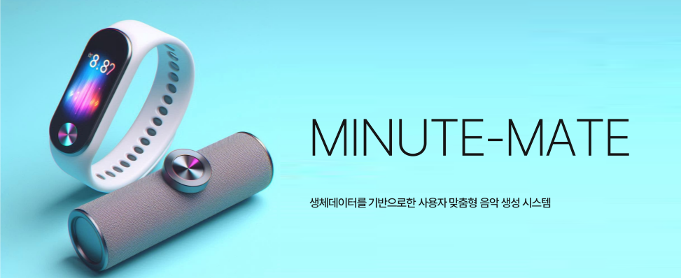

제3회 SKKU 메이킹 해커톤 
=====

[이미지 출처-제13대 성균관대학교 정보통신대학 학생회 다:ON 인스타그램(링크)](https://www.instagram.com/skku_ice_daon/p/C81WHHaS2s4/) 

SKKU 메이킹 해커톤은 팀별 IoT 창업 아이템을 직접 제작하여 시연하는 대회입니다. 

## Overview

Minute-mate는 사용자가 외부에서 실내로 들어올 시, 1 Minute 동안의 사용자의 **생체 데이터**를 기반으로 음악을 생성, 재생하는 시스템입니다.

  
개발 배경

  
  1. 외부에서 받은 스트레스는 가정에서 해소할 필요가 있습니다. 스트레스 해소 방법 중 많은 사람들이 음악을 듣습니다. 그중 Minute-mate는 일상생활에서의 배경음악을 제공하는 것을 목표로 합니다. 

  2. **데이터 과부하**로 인한 부담으로부터의 **해방**됩니다.유튜브, 스포티파이 등은 사용자에게 추천시스템을 통하여 음악을 제공합니다.그러나, 배경음악 같은 경우 해당 사용자에게 100% 만족시킬 수는 없을 뿐더러, 많은 양의 컨텐츠는 사용자에게 선택의 부담이 될 수 있습니다. 

    
개발 기술적 근거

    
1. 생체 데이터의 분석
생체 데이터는 사용자의 신체적 상태를 실시간으로 파악할 수 있는 중요한 정보를 제공합니다. 우선 체온은 밖에서의 사용자가 받은 스트레스를 파악할 수 있게 합니다. 스트레스 상태에서는 체온이 낮아지는 경향이 있다고 합니다.[[1]](https://journals.biologists.com/jeb/article/226/20/jeb246552/334301/It-s-cool-to-be-stressed-body-surface-temperatures)
두 번쨰로는, 심박수입니다. HRV는 스트레스 감지에 중요한 지표로 사용됩니다. 다양한 머신러닝(ML) 기법, 예를 들어 서포트 벡터 머신(SVM), 랜덤 포레스트(RF), 신경망 등이 ECG 센서를 통해 수집된 HRV 데이터를 분석하여 스트레스 수준을 예측하는 데 사용되었습니다. 이는 착용 가능한 장치를 통해 생리적 신호를 측정하여 스트레스를 감지하는 데 유용함을 보여줍니다​ [[2]](https://link.springer.com/article/10.1007/s12559-023-10200-0)
마지막으로는 습도입니다. 체온, 땀 등을 분석하여 스트레스의 수준을 파악할 수 있습니다.[[3]](https://link.springer.com/article/10.1007/s00521-023-08681-z)
2. 생체 데이터를 기반으로 한 음악 생성의 타당성
생체 데이터를 활용한 음악 생성은 사용자의 현재 상태를 반영하는 맞춤형 콘텐츠를 제공할 수 있다는 점에서 타당성이 있습니다. 생체 데이터는 사용자의 감정 상태를 파악하는 데 중요한 정보를 제공하며, 이를 기반으로 사용자 맞춤형 음악을 생성함으로써 사용자 경험을 향상시킬 수 있습니다. 예를 들어, 스트레스 수준이 높은 사용자를 위해 진정 효과가 있는 음악을 생성하거나, 활력이 필요한 순간에는 에너제틱한 음악을 제공하는 등의 활용이 가능합니다​ [[4]](https://link.springer.com/article/10.1007/s00500-023-09457-2)

### System Design

## Hardware 
메이킹 해커톤이므로 전자보드를 직접 제작하였습니다.
### Smart Band
스마트 밴드는 **ESP-Wroom-32**를 통해 제작되었습니다. (다이어그램은 이해를 위한 것일 뿐 실제 제작된 작품과 차이가 있음)
||
1. Heart Rate Sensor[SEN00203] : 심장 박동 수를 측정하기 위한 센서   2. DHT11 : 온도/습도를 측정하기 위한 센서   3. MPU-6050 : 사용자 움직임 측정을 위한 자이로센서 
|
|--|--|

### Smart Speaker 
스마트 스피커는 **Raspberry pi 4** 를 통해 제작되었습니다. 스마트 스피커는 생성형 AI API 제어를 위한 역할이 크므로 상세한 설명은 아래의 소프트웨어 부분으로 대체합니다. 

  
생성형 AI 모델 선정과 그 이유

  
  1. GPT-4o-mini
    멀티모달 LLM을 이용하여 앞으로의 발전 가능성을 열어두었습니다. 사용자의 상태 파악에 있어서, 오디오, 이미지, 동영상 등의 텍스트 외의 input을 받을 수 있도록 개선될 수 있습니다. 
  2.  MusicGen 
    다양한 Text-to-Music 모델이 존재합니다. 그러나, 해당 모델들은 다소 높은 비용이 필요하고, 프로젝트 미닛-메이트에서는 명상 음악에 가까운 공간 배경 음악을 제공하므로 instrument 음악 생성 능력이 좋은 MusicGen을 이요하여 개발하였습니다. 

## Software 
MVP 모델을 제작하는 것으로 생체 데이터를 분석하기 위한 머신러닝 알고리즘은 적용되지 않고, 수치에 따라 다른 프롬프트가 입력되도록 설계되었습니다. 
### Sequence Diagram 

### Prompt for Generative AI 
1.  GPT-4o-mini
   
(1) 사용자의 데이터에 따른 프롬프트 자동 수정 알고리즘 

위 이미지와 같이 사용자의 상태에 따라 각각 다른 프롬프트가 작성되어 GPT-4o에게 전달됩니다. 이를 통해 토큰 수를 아낄 수 있으며, GPT-4o-mini가 필요한 가이드라인에 Attention할 수 있게 됩니다. 

(2) 프롬프트를 기반으로 두 가지 응답 생성 

GPT-4o-mini는 프롬프트를 기반으로 두 가지 응답을 생성합니다. 첫 째, 음성 안내. 자기 자신이 musicGen을 위해 생성한 프롬프트를 기반으로, 생성될 음악에 대하여 설명합니다. 둘 째, musicGen에게 입력될 프롬프트가 생성됩니다. 사용자의 상태에 맞춘 가이드라인이 프롬프트를 통해 전달되어, 사용자 생체 데이터 맞춤형 음악이 생성됩니다. 
3. MusicGen 
MusicGen을 위한 프롬프트는 위의 GPT-4o-mini가 생성합니다. 

## Future Works
1. On-device
   
사용자의 생체데이터는 중요한 정보이므로 양자화를 통해 온-디바이스 서비스가 가능하도록 합니다. 

2. APP 

현재의 앱은 MVP 모델이므로 앱-인벤터로 개발되었습니다. 하지만, 각자의 음악이 컨텐츠가 되어, 공유할 수 있는 SNS로의 발전을 목표로합니다.

## Contributors
| 이름 | 전공 |역할 | 깃허브 주소 |
| --- |--| --- | --- |
| 한석호(**팀장**) |시스템경영공학/차세대반도체공학| 생성형 AI API 제어, 프롬프트 엔지니어링 | |
| 허혁 |전자전기공학| 보드 코딩 및 센서 제어 |  |
| 전승민 |전자전기공학| 기획자, 제품 디자인 |  |
